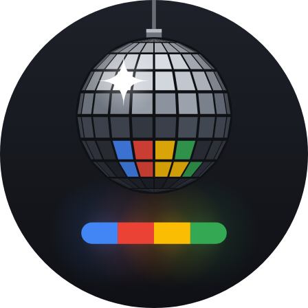

  

<h1 align="center">Disco</h1>

  <b>Glowbar Disco, one click away.</b> 
  An icon in your Googlebook's app list that opens Glowbar Disco, and nothing else.

  <a href="../../releases/latest/download/Disco.apk"><b>⬇ Download Disco.apk</b></a>
  &nbsp;·&nbsp; <a href="#install">Install</a>
  &nbsp;·&nbsp; <a href="#privacy">Privacy</a>

  
  
  
  
  

A personal hobby project by Fika Labs, proudly developed on a Googlebook.
Not affiliated with or endorsed by any employer (<a href="#about-this-project">more</a>).

## What it does

Every Googlebook comes with **Glowbar Disco**, the Glowbar's party mode: themes, presets and a music sync for the
light bar on the lid. It has no icon of its own, so it's hard to find. Disco puts one in your app list (and on your
taskbar, if you pin it). Click it and Glowbar Disco opens; click it again and the same window comes back.

Disco itself has no window, no settings and nothing running in the background. It is about 30 KB.

The first time Glowbar Disco opens, it asks for the microphone, for its music sync. That question is Glowbar
Disco's, not Disco's: answer it however you like.

## Install

Disco is made for Googlebooks (Googlebook OS, Android 17); other devices don't have Glowbar Disco.

1. On your Googlebook, download **[Disco.apk](../../releases/latest/download/Disco.apk)** from the latest release.
2. Open it from Chrome's downloads or the Files app. If Android asks, allow Chrome (or Files) to install apps, then
   tap **Install**. Google Play Protect may then say *"App blocked to protect your device"* because it hasn't seen
   an app from this developer before: tap **More details** › **Install anyway**.
3. Find **Disco** in your app list. Pin it to the taskbar like any other app if you want it there.

## Privacy

Disco asks for no permissions, has no internet access and keeps no data. All it does is ask Android to open
`glowbar://disco`.

## About this project

Disco is my personal hobby project, published as Fika Labs. It has no affiliation with my employer: my employer
didn't make, sponsor, review or endorse it, and Disco doesn't endorse my employer or its products either.

It was developed on a Googlebook and tested on one. Glowbar and Googlebook belong to Google; Disco isn't made by or
affiliated with Google.

With a little help from Claude.

## License

[MIT](LICENSE).
